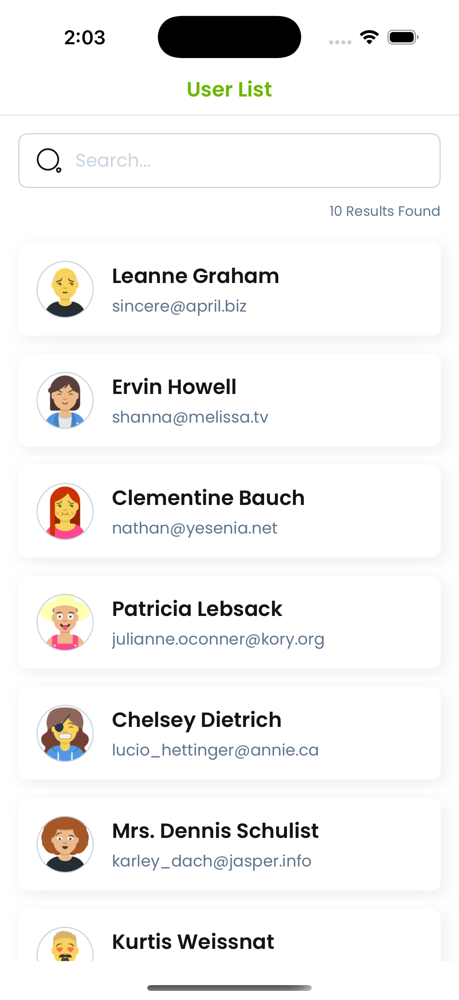
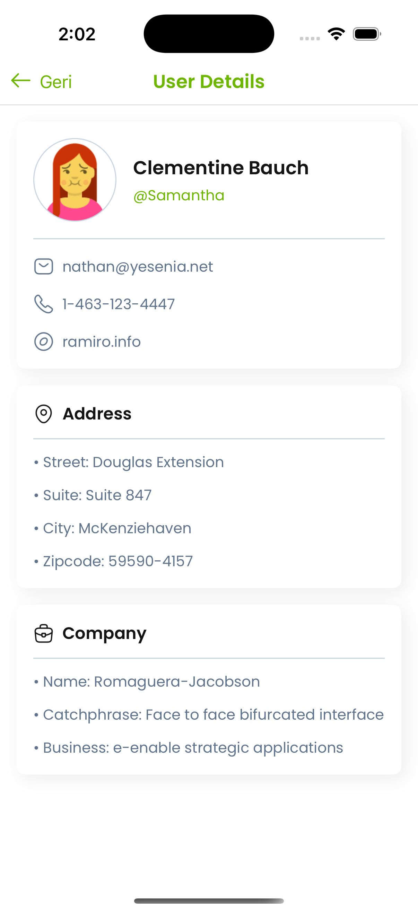

# **SevenAppsCase**  

## ** Overview**  
This project is an iOS application built using **Swift** and **UIKit**, following the **MVVM** architecture. It retrieves user data from the [JSONPlaceholder](https://jsonplaceholder.typicode.com/) API and displays a user list, with the ability to navigate to detailed user information.

---

## ** Objectives**  
- Implement **MVVM** for better separation of concerns.  
- Fetch and display data from **JSONPlaceholder API**.  
- Utilize **Repository Pattern** for data management.  
- Navigate between screens while maintaining clean architecture.  
- Write **readable, maintainable, and scalable** code.  

---

## ** Features**  

### ** User List Screen**  
✔ Fetches a list of users from JSONPlaceholder.  
✔ Displays user **name** and **email** in a `UITableView`.  
✔ Supports search functionality to filter users.  

### ** User Detail Screen**  
✔ Displays detailed information including **name, email, phone, and website**.  
✔ Uses a **custom UI component** for structured display.  
✔ Implements smooth navigation between screens.  

### ** Additional Features**  
✔ **Networking Layer**: Uses a structured API service to fetch data.  
✔ **Repository Pattern**: Centralized data management for scalability.  
✔ **Custom UI Components**: Reusable `UIView` components for better UI consistency.  
✔ **SOLID Principles**: Ensures high-quality and maintainable code.  

---

## ** Technologies & Tools**  
- **Swift** (UIKit)  
- **MVVM Architecture**  
- **URLSession for Networking**  
- **JSON Decoding with Codable**  
- **Repository Pattern**  
- **Auto Layout & Programmatic UI**  
- **Dependency Injection**  

---

## **📸 Screenshots**  

### **Splash Screen**  
Displays a list of users with their names and emails, including a search functionality.

---

### **User List Screen**  
Displays a list of users with their names and emails, including a search functionality.

---

### **User Details Screen**  
Shows detailed information about the selected user including name, email, phone, and website.

